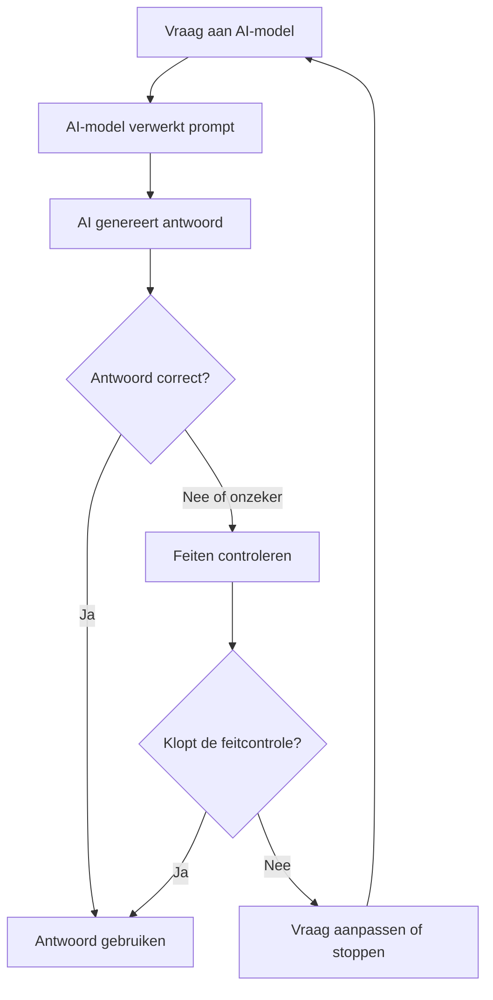

# AI Academy Module voor Scholen (12–18 jaar)

**Executive Summary:** Dit modulair lesprogramma introduceert middelbare scholieren aan verantwoord gebruik van AI. Leerlingen leren over kosten en milieu-impact van AI (energie, CO₂-uitstoot, waterverbruik) en efficiënt omgaan met API’s en rekenkracht. Ze verkennen belangrijke begrippen zoals benchmarks en evaluatiemaatstaven (nauwkeurigheid, precisie, recall, F1-score, enz.) en vergelijken voorbeeldtoepassingen. We behandelen modelkeuze (bijv. eenvoudige vs diepe modellen, lokaal vs cloud) met bijbehorende voors en tegens. Een deel gaat over betrouwbaarheid: “hallucinaties” van taalmodellen worden uitgelegd met voorbeelden, en leerlingen oefenen met feitcontrole. Juridische thema’s (GDPR, AI-verordening) komen aan bod: welke data mag je invoeren en welke toepassingen zijn verboden of risicovol? Bijvoorbeeld verbiedt de EU emotieherkenning bij leerlingen en vereist de AI-wet CE-markering en toezicht bij hoog-risico toepassingen. Tot slot leren leerlingen prompt engineering: ze formuleren heldere instructies, werken iteratief en gebruiken voorbeelden om AI beter te laten presteren. Bij elke sectie horen vijf toetsvragen (met antwoorden) en een praktijkopdracht waarin leerlingen zelf een AI-tool gebruiken. De module bevat checklists en een begrippenlijst. Een voorbeeld-flowchart illustreert de AI-vraagloop: 

**Lesoverzicht en resources:** De module is ontworpen voor ca. 5–6 lessen (á 45–60 min), met individuele en groepsopdrachten. Een mogelijke lesindeling: 
1. Inleiding AI & duurzaamheid; 
2. Belangrijke concepten en meetmethoden; 
3. Modeltypen en toepassingen; 
4. Betrouwbaarheid & privacy; 
5. Prompttechnieken. 

Afhankelijk van de school kunnen segmenten gecombineerd of uitgebreider worden. Benodigd: devices met internet, toegang tot een gratis AI-chat (ChatGPT of vergelijkbaar) of lokaal klein LLM (bijv. LLaMA 7B via Hugging Face, als technisch mogelijk). Kosten zijn laag voor klein gebruik – ChatGPT biedt gratis tier, grotere modellen vragen enkele centen per 1000 tokens (GPT-6 Astra: $10 per miljoen in, $50 per miljoen uit). Voorbereid budget van €5–€10 dekking is meestal ruim voldoende. Resources: computers/tablets, rekenhulpmiddelen (excelsheet, Python of webtools voor omzetting tokens/kWh), en veilige internettoegang (met leerlingen waarschuwen geen persoonlijke data te delen). Het programma kan eenvoudig worden aangepast voor leeftijdsgroepen: voor 12–15 jaar ligt de nadruk op eenvoudige voorbeelden en visuele uitleg; bij 16–18 jaar komt meer wiskundige en juridische detail aan bod (bijv. nauwkeurige kostencalculaties, GDPR-artikelen).

**Groen AI & efficiëntie:** AI gebruikt veel rekenkracht. Zo bleek uit onderzoek dat het trainen van een NLP-model (2019) ruim **300.000 kg CO₂** uitstootte – gelijk aan 125 retourvluchten NYC–Beijing. Gelukkig zijn individuele AI-oproepen veel kleiner: schattingen lopen 2–3 gram CO₂ per ChatGPT-vraag. Zelfs 10 vragen per dag kost slechts ~11 kg CO₂/jaar (≈0,1–0,2 % van iemands jaarlijkse elektriciteitsgebruik). Toch draagt het bij. De energie- en waterconsumptie van datacenters leidt tot zorgen: gemeenschappen klagen over het **elektriciteits- en waterverbruik** van AI-servers. Data centres koelen met water (vaak koud water of verdamping), en verbruiken per kWh vergelijkbare hoeveelheden water als een huishouden op jaarbasis. Belangrijke factoren die de footprint bepalen zijn: _modeltype_, _gebruikshoeveelheid_ (aantal queries of tokens) en _inputgrootte/resolutie_. Een korte prompt en klein model kost relatief weinig; beelden genereren of videotoepassingen gebruiken veel meer rekenkracht. EU-project SustainML werkt aan AI-ontwerp dat energie bespaart. Kernboodschap voor leerlingen: stel alleen de benodigdheden op (vraag “Wat heb ik echt nodig?”) en hergebruik beschikbare modellen of datasets om onnodig training te vermijden. 

- **Studietekst:** AI verbruikt veel energie. Het dataverkeer en de servers slurpen elektriciteit en water. Gebruik daarom zoveel mogelijk gratis bestaande modellen en koop GPU-tijd alleen als het doel groot genoeg is. Vraag je bij een AI-project voortdurend af: “Wat hebben we echt nodig?”. Sommige gebruikers gaan zuinig om met AI (enkele prompts per dag) omdat de CO₂-impact dan verwaarloosbaar is. Let op de betaalde API’s: OpenAI’s nieuwste GPT-6 kost circa $10 per miljoen ingetikte tokens en $50 per miljoen gegenereerde tokens. Dit betekent dat 1000 woorden genereren (~2000 tokens) ~$0,12 kost. Voortdurend grote vragen stellen kan dus snel enkele euro’s kosten. Overweeg ook of een kleiner of lokaal model volstaat, wat elektriciteit en privacy kan besparen. 

- **Toetsvragen:** 
  1. Waarom heeft AI “energievoetafdruk”? (Door rekenwerk in servers; nodig stroom en koeling.) 
  2. Geef een voorbeeld van een manier om energie te besparen bij AI. (Gebruik hergebruikte modellen, kortere prompts, groene stroom, lokale hardware, etc.) 
  3. Noem één reden waarom waterverbruik bij datacenters belangrijk is. (Data centers koelen met water, dus veel vragen kosten water.) 
  4. Bereken (schematisch) de CO₂-uitstoot van 20 ChatGPT-vragen per dag gedurende een jaar. (20×365×~3g≈21,9kg CO₂.) 
  5. Hoe kun je het hergebruik van modellen terugzien in minder energieverbruik? (Minder training, minder databeheer nodig; Inria raadt aan bestaande modellen of data te hergebruiken.) 

- **Opdracht (praktisch, teamwork):** *Leerdoel:* Inzicht krijgen in energie- en kostenaspecten van AI. *Opdracht:* (1) Kies een eenvoudige tekst- of afbeeldingsopdracht (bv. “Schrijf een kort verhaal over dieren in de ruimte” of “Genereer een landschap uit tekst”). Gebruik een AI-tool (ChatGPT, DALL-E, of gratis model) om het antwoord te krijgen. Tel het aantal tekens/tokens of sec. verwerkingsduur. (2) Bereken met een formule of website de kosten (bijv. $$ \text{kosten} = \text{tokens} \times \frac{\$50}{10^6} $$ voor een GPT-6-achtig model) en de geschatte CO₂ (bijv. 3 g per vraag). (3) Vergelijk dit met een menselijke aanpak (schatting eigen schrijfkosten, computerverbruik). *Beveiliging:* Deel geen persoonlijke gegevens in de prompt. *Beoordeling:* Rubric beoordeelt nauwkeurigheid van berekeningen, logica (bv. “de aannames zijn realistisch”) en reflectie op milieu (de student legt uit of dit veel/minder/veel is ten opzichte van hun eigen energieverbruik). 

**Belangrijke Begrippen en Evaluatiemaatstaven:** Leer de kernwoorden en meetmethodes van AI. Bijvoorbeeld: **‘benchmark’** is een standaardtaak of dataset om modellen te vergelijken (zoals GLUE voor taal of ImageNet voor beeld). We bespreken veelgebruikte **evaluation metrics**: nauwkeurigheid (accuracy), precisie, recall, F1-score, enzovoort – wat ze zeggen over fouten en correcte voorspellingen. (Bij classificatie: zie termen *True Positive/Negative*, *False Positive/Negative*.) Ook voor taalmodellen bestaan metriek (bleu/rouge voor vertaling/samenvatting, perplexity). In eenvoudige bewoording: “Als een model 100 voorbeelden beoordeelt en er 90 goed zijn, is de nauwkeurigheid 90%. Maar bij rare klassen kan bijvoorbeeld recall belangrijker zijn.” Zo snappen leerlingen hoe AI-resultaten beoordeeld worden. 

- **Studietekst:** AI-systemen worden opingenomen met testdata, en de uitkomsten worden gemeten. Als voorbeeld: een spamfilter wordt getest op 100 e-mails, waarvan er 80 spam zijn. Als het model 75 spam correct herkent en 10 ‘goede’ e-mails fout klassificeert, kun je de **precision** (hoeveel van de aangemerkte spam echt spam was) en **recall** (hoeveel van alle spam herkend werd) berekenen. Deze termen (precision/recall/F1) geven nuance bij onevenwichtige data. Tegenover nauwkeurigheid (Accuracy) zetten we de **foutmarge**; een hoge nauwkeurigheid kan misleidend zijn als een model altijd “nee” antwoordt op 99% nee-vragen (100% acc., 0% recall). Daarnaast kennen we **perplexity** voor taalmodellen (lager is beter, het is een maat voor hoe goed het model tekst kan voorspellen). Kortom: benchmarks en metrics zijn meetinstrumenten om AI te vergelijken en te beoordelen. 

- **Toetsvragen:** 
  1. Leg in eigen woorden uit wat “accuracy” is en waarom dit soms misleidend kan zijn. (*Antwoord:* Percentage correcte voorspellingen; misleidend als klassen scheef verdeeld zijn.) 
  2. Wat is het verschil tussen precisie en recall? Geef een voorbeeld (bijv. ziekte-test). (*Antwoord:* Precisie = van alle positieve voorspellingen, hoeveel echt positief waren; recall = van alle echte positieve, hoeveel werden herkend.) 
  3. Wanneer is F1-score handig? (*Antwoord:* Als je balans zoekt tussen precisie en recall; het is de harmonische gemiddelde van beide.) 
  4. Noem een bekende benchmark dataset voor beeldherkenning en voor taal. (*Antwoord:* ImageNet voor beeld, GLUE of SQuAD voor tekst, bijvoorbeeld.) 
  5. Een spamfilter voorspelt bij 100 e-mails 50 spam, waarvan 45 correct en 5 ten onrechte. Van de 50 niet-spam zijn 40 correct en 10 (vals) gemarkeerd als spam. Bereken precisie, recall en accuracy. (*Antwoord:* Precisie = 45/(45+5) = 90%, Recall = 45/50 = 90%, Accuracy = (45+40)/100 = 85%.*)

- **Opdracht (laboratoriumopdracht):** *Leerdoel:* Begrijpen hoe AI-modellen geëvalueerd worden. *Opdracht:* De klas krijgt een set voorbeelddata (of zelf gemaakt) voor een eenvoudige taak, bijv. gevoelens van 10 korte zinnen (compliment vs. kritiek). De leraar heeft (anoniem) de juiste labels. (1) Leerlingen vragen AI (bv. ChatGPT of een online sentimenttool) om elke zin te classificeren. (2) Noteer de AI-uitkomsten en bereken vervolgens met pen en papier de accuracy, precisie en recall (gebruik formule). (3) Bespreek welke metric het beste past in dit voorbeeld en waarom. *Output:* een verslagje met berekeningen en conclusies. *Beveiliging:* geen persoonlijke data in de voorbeeldzinnen. *Rubric:* juistheid van berekening, uitleg van resultaten, en begrip van metric-keuze. 

**Modelkeuze en Trade-offs:** Niet elk AI-probleem vraagt om het grootste model. Kleinere modellen (zoals beslisbomen of lichtgewicht neurale netten) zijn sneller en transparanter, maar minder krachtig. Grote neurale netwerken (deep learning, LLM’s) leveren vaak betere prestaties bij complexe taken (beeld- en taalbegrip) maar kosten veel rekenkracht en zijn minder “begrijpelijk” voor mensen. Een handige vergelijkingstabel:

| **Modeltype**             | **Voorbeelden**               | **Sterke punten**                    | **Zwakke punten**                     |
|---------------------------|-------------------------------|--------------------------------------|---------------------------------------|
| Regel- of richtlijnenmodel| Excel-formule, if-then regels | Direct, snel, transparant (u ziet logica) | Werkt alleen bij duidelijk gedefinieerde regels, niet ‘lerend’ |
| Klassieke ML (klein)      | Decision tree, SVM, K-means   | Weinig data nodig, sneller trainen    | Minder goed bij ruis/complexe patronen |
| Convolutioneel neuraal net| LeNet, ResNet (beeld)         | Herkent patronen in afbeeldingen zeer goed | Vergt veel data en rekenkracht om te trainen |
| Recurrent/Transformer LLM | GPT, BERT, LLaMA (tekst)      | Zeer vloeiend in taal, veelzijdig    | Duur in training/inferentie, kan hallucineren, privacyissue (cloud) |

De keus hangt af van context: voor een eenduidige rekensom kan een regelmodel volstaan; voor een chatbot is een LLM nodig. Cloudmodellen (zoals OpenAI’s GPT-6) zijn krachtig maar leveren antwoorden via internet (privacyoverwegingen) en vragen API-kosten. Lokale modellen (bijv. open source LLaMA of op schoolserver) houden data privaat en kunnen offline draaien, maar zijn vaak minder up-to-date en vereisen eigen hardware. 

- **Studietekst:** Bij modelkeuze weeg je eigenschappen af. Een simpel classificatiemodel (zoals een beslissingsboom) is snel en begrijpelijk, maar kan slecht schalen bij grote datastromen of ongestructureerde data. Diepe neurale netwerken daarentegen kunnen complexe patronen leren, bijvoorbeeld taal begrijpen of afbeeldingen herkennen, maar zijn kostbaar in energie en moeilijk te doorgronden (de “black box”). Generatieve LLM’s (Large Language Models) zoals GPT-6 leveren indrukwekkende teksten, maar brengen risico’s mee (hallucinaties) en kosten (API-tarieven in dollars per token). Op school let je ook op licentie en controle: open modellen bieden inzicht in training, gesloten cloudmodellen niet.  

- **Toetsvragen:** 
  1. Geef twee voorbeelden van eenvoudig vs. complex AI-model en hun voor- en nadelen. (Bijv. beslissingsboom vs. LLM; zie tabel.) 
  2. Waarom kan het slimmer zijn om een bestaand model te **fine-tunen** in plaats van zelf een model te trainen? (Bespaart veel rekenkracht/CO₂; je hebt al data en model.) 
  3. Welke aspecten van een modelkeuze kunnen invloed hebben op privacy? (Ofwel: online vs lokaal draaien; gebruik van persoonlijke data; toegang tot modelupdates.) 
  4. Wat betekent “modelcapaciteit”, en hoe hangt dit samen met kwaliteit en kosten? (Grotere capaciteit = meer parameters, vaak betere prestaties maar hogere kosten en energie.) 
  5. Noem één voorbeeld van een trade-off tussen nauwkeurigheid en bruikbaarheid in modellen. (Bijv. een klein snel model is minder accuraat dan een zware, maar bruikbaarder op smartphone.) 

- **Opdracht (vergelijkend experiment):** *Leerdoel:* Zelf ervaren welke verschillen modelkeuze maakt. *Opdracht:* Gebruik twee verschillende AI-tools voor dezelfde taak. Bijvoorbeeld: laat ChatGPT (grote cloud-LLM) en een eenvoudig online API (bv. Hugging Face’s gratis sentiment-API) dezelfde eenvoudige taak uitvoeren (bijv. “Beschrijf de foto”, “Beantwoord deze rekensom”). Vergelijk: (1) kwaliteit van output (nauwkeurigheid, volledigheid), (2) snelheid (doorlooptijd), (3) gemak (moet je code schrijven of kan je tikken). Schrijf de bevindingen op. *Beveiliging:* Gebruik neutrale, niet-gevoelige inhoud. *Rubric:* Rapport bevat duidelijke vergelijking, conclusie welke model sterk/zwak is, en onderbouwing (gebruik voorbeelden). 

**Betrouwbaarheid en Verifiëren:** AI-modellen **hallucineren** soms: ze verzinnen plausibele maar foutieve antwoorden. Zo gaf een chatbot meerdere keren een onjuiste geboortedatum toen naar Adam Tauman Kalai werd gevraagd. Hallucinaties ontstaan omdat modellen patronen in tekst volgen, niet omdat ze «wetenschap» begrijpen. Bij voorbeeld kan een LLM op willekeur gokken als het zeker antwoord niet weet. Uit OpenAI-onderzoek blijkt dat oudere modellen vaak zelfverzekerd foutjes maken, terwijl getrainde modellen soms “onzeker zeggen dat ze het niet weten”. **Feiten controleren** blijft cruciaal. Leerlingen oefenen met kritisch lezen: altijd vragen naar bronnen, dubbele check (Google, Wikipedia), en bij twijfel alternatieve modellen raadplegen. 

- **Studietekst:** Vertrouw de AI niet blind. Een model zegt geen “ik weet het niet”, maar genereert gewoon iets. Deze hallucinaties kunnen onschuldig zijn, maar leiden soms tot misinformatie (zoals valse nieuwsverspreiding). Omdat evaluaties vaak juistheid belonen, kiest het model soms voor gok-antwoorden. Daarom is het belangrijk de output te **verifiëren**: vergelijk met betrouwbare bronnen (leraar, boeken, internet). Hanteer ook “enkelvoud aan bronnen”: als verschillende modellen of een mens* het zeggen, is de kans groter dat het klopt. Privacyjurist Max Schrems meldde dat ChatGPTs foutieve persoonsgegevensverstrekking zelfs tegen de AVG in gaat. In de klas leren leerlingen systematisch controleren: schrijven ze bronnen op? Laten ze een antwoord proeflezen door klasgenoten of opzoeken? Zet voorbeelden (“Fact-check your AI”) in de checklist. 

- **Toetsvragen:** 
  1. Wat is een “hallucinatie” bij AI? Geef een voorbeeld. (*Antwoord:* Een plausibel maar onjuist antwoord; bijv. ChatGPT verzint een bestaand citaat.) 
  2. Waarom neigen modellen soms naar “gokken” in plaats van toegeven dat ze iets niet weten? (*Antwoord:* De toets van het model beloont juiste antwoorden; niet antwoorden telt als fout.) 
  3. Noem minstens twee manieren om AI-uitvoer te controleren op feiten. (*Antwoord:* Websites raadplegen, meerdere modellen vragen, eigen kennis toepassen, betrouwbare literatuur.) 
  4. Wat deed Schrems (privacyspecialist) met ChatGPT als voorbeeld van AI-fout? (*Antwoord:* Hij vroeg om zijn geboortejaar; ChatGPT gaf steeds foutieve data en weigerde het te corrigeren.) 
  5. Beschrijf kort wat je doet als een AI-model *niet zeker* is van een antwoord. (*Antwoord:* Eigen onderzoek doen, antwoord niet gebruiken, vragen om opheldering.) 

- **Opdracht (praktisch):** *Leerdoel:* Hallucinaties herkennen en fact-checken. *Opdracht:* Geef de klas een paar feitelijke vragen (bijv. “Wat is de hoofdstad van Australië?”, “Noem drie planeten met ringen”). Laat leerlingen ChatGPT antwoorden laten genereren en opschrijven. Vergelijk vervolgens met bekende feiten (boeken/internet). Identificeer eventuele verschillen. Bespreek: welke antwoorden waren fout, en hoe had je dat kunnen controleren? *Output:* Een kort verslag met vraag, AI-antwoord, feitelijke correctie en bron (bijv. Wikipedia-lijn). *Beveiliging:* Kies onschuldige feitenvragen (geen persoonsgegevens). *Rubric:* Beoordeel of fouten (hallucinaties) herkend zijn, correcte feitcontrole met bron is getoond, en conclusie (“AI gebruik met voorzichtigheid”). 

**Privacy & Juridische Context (EU/GDPR):** In de EU gelden strenge regels voor persoonsgegevens. ChatGPT en vergelijkbare tools mogen geen privéinformatie van leerlingen of leraren opslaan of hergebruiken. Volgens de **AVG/GDPR** moeten gegevens minimaal, relevant en met toestemming gebruikt worden. Leerlingen leren wél algemene vragen stellen en zelf geen namen, adressen of ID’s invoeren. Onder de **EU AI-verordening** gelden extra eisen voor onderwijs-AI: systemen voor “toetsing en beoordeling” van studenten zijn *hoog risico*, waarbij een CE-markering en menselijk toezicht verplicht zijn. Bepaalde toepassingen zijn expliciet verboden, zoals emotieherkenning bij leerlingen (AI die gemoedstoestand afleidt uit gezichtsuitdrukking). Scholen zijn dan “gebruikers” van AI, niet ontwikkelaars; ze moeten de gebruiksaanwijzing volgen en toezicht houden. Voorbeeld: Als een school AI inzet voor leerlingvolgsysteem, moet de leverancier compliant zijn; de school zelf moet zorgen dat geen extra gegevens worden gebruikt. 

- **Studietekst:** AI-systemen behandelen gegevens volgens de wet. In de EU betekent dat vooral: vraag alleen (geanonimiseerde) data die echt nodig is (dataminimalisatie). Deel nooit bijzondere persoonsgegevens of privézaken met AI (bv. medische info, Burgerservicenummers). Volgens de AI-wet moet je naar de risico’s kijken: veelgebruikte AI voor leren is vaak “laag risico” (bijv. ChatGPT als schrijfcoach), maar ga je AI gebruiken voor beoordelingen of surveillancesystemen, dan gelden strenge eisen. In de klas: bespreek dat je een leerling bijvoorbeeld mag laten vragen om hulp bij een opstel (algemene termen), maar niet om persoonlijke examenresultaten te analyseren met onveilige AI. 

- **Toetsvragen:** 
  1. Welke gegevens mag je wel en niet invoeren in een AI-chat? (Mag anonieme, algemene data zijn, geen persoonlijke identificatie zoals naam/rolnummer.) 
  2. Wat zegt de GDPR over het verzamelen van leerlinggegevens voor AI? (Alleen met geldige grondslag/informatiebeveiliging/ toestemming, en minimaal datagebruik.) 
  3. Noem één voorwaarde uit de EU AI-verordening voor hoog-risico AI in scholen. (CE-keurmerk, naleven van gebruiksaanwijzingen, en toezicht door deskundige.) 
  4. Waarom is het AI-chatten met persoonlijke data van klasgenoten gevaarlijk? (Privacy- en veiligheidsrisico: kan in strijd zijn met GDPR, data kan onbedoeld opgeslagen of misbruikt worden.) 
  5. Geef een concreet voorbeeld van een verboden AI-toepassing in het onderwijs volgens de EU. (Emotieherkenning bij leerlingen mag niet.) 

- **Opdracht (casusbespreking):** *Leerdoel:* Toepassen van privacyregels op AI. *Opdracht:* Creëer twee scenario’s: (a) Correct gebruik: een leerling gebruikt ChatGPT om woordenschat uit te leggen (zonder naam of persoonsgegevens). (b) Onjuist gebruik: een leerling geeft gezondheidsgegevens of leerling-ID aan ChatGPT. Bespreek in groepjes waarom (b) onveilig is en welke wettelijke regels hier gelden. Bedenk hoe je casus (b) had kunnen oplossen (bijv. door alleen geanonimiseerde info te gebruiken). *Output:* Een korte poster of presentatie met regels/checklist (“Mag wel / Mag niet”) en een aanbeveling voor de school (bv. digitaal “AI-beleid”). *Rubric:* Inzicht in privacyregels, correct onderscheid in wél/niet delen, en bruikbare checklist. 

**Prompt Engineering & Werkprocessen:** Een goede prompt is duidelijk, compleet en gestructureerd. Geef de AI specifieke context (wie speelt het? welk publiek? toneel?), lengte en outputstijl aan. Bijvoorbeeld: “_Je bent een leraar biologie. Schrijf in 200 woorden een eenvoudig verhaaltje over fotosynthese voor 12-jarigen._” (geeft rol, lengte, doelgroep). Actieve werkwoorden zoals “schrijf”, “geef”, “vergelijk” helpen de taak duidelijk te maken. Voor complexe taken kun je stappen uitschrijven: “_Stel eerst een plan op, dan schrijf het antwoord._” (chain-of-thought). UvA geeft de tip “CLEAR”: Context, Lengte, Voorbeelden, Actieve werkwoorden, Rol. Leerlingen experimenteren door één vraag op verschillende manieren te stellen en vergelijken: wat verandert er in het antwoord? Iteratie is krachtig: evalueer het antwoord en vraag aanvullingen of correcties. 

- **Studietekst:** De kunst is om geen vage vraag te stellen. Wil je een samenvatting? Geef een voorbeeldlengt. Wil je humor? Zeg het erbij. Een goed geformuleerde prompt bevat **context** (bijv. onderwerp of rol), **stijl en lengte** (bv. “zakelijk rapport, 150 woorden”), **activerende instructies** (“vergelijk…”, “geef 3 voorbeelden”), en eventueel **voorbeelden** van gewenste output. Hierdoor krijgt de AI houvast en wordt het antwoord relevanter. Probeer zelf: vraag om een “samenvatting over de Franse Revolutie”. Let op: alleen “samenvatten” kan tot algemeen sop leiden; beter zet je “In 100 woorden, alsof je lesgeeft aan klas 2.” Experimenteer: welke prompt levert het beste resultaat? 

- **Toetsvragen:** 
  1. Waarom is het belangrijk om een “actief werkwoord” in je prompt te gebruiken? (*Antwoord:* Maakt de taak duidelijk, zoals “Leg uit”, “Noem”, “Vergelijk”.*) 
  2. Geef twee elementen die je toevoegt aan een prompt om een beter antwoord te krijgen. (*Antwoord:* Context/rol (wie is de AI?), stijl (formeel/informeel), lengte, specifieke voorbeelden, doelgroep, enz.*) 
  3. Wat kun je doen als het AI-antwoord te kort of onduidelijk is? (*Antwoord:* Herhaal de vraag met meer details, vraag om verduidelijking of een langere uitleg, of geef extra instructie.) 
  4. Beschrijf wat “chain of thought” prompts zijn. (*Antwoord:* Je vraagt de AI het antwoord stap voor stap uit te leggen voordat het antwoord geeft, of om tussenstappen te tonen.) 
  5. Wat is het verschil tussen een vage en een gerichte prompt? Geef een voorbeeld. (*Antwoord:* Vage: “Schrijf iets over bomen.” — kan van alles zijn. Gericht: “Schrijf een kort gedicht over een eik in de herfst, in 4 regels”.*) 

- **Opdracht (prompt-iteratie):** *Leerdoel:* Leren hoe promptformulering het AI-antwoord beïnvloedt. *Opdracht:* Kies een onderwerp uit het curriculum (bijv. een Frans woord, wiskundig begrip, historische gebeurtenis). Formuleer eerst een eenvoudige vraag voor ChatGPT (“Vertel iets over X”). Vraag een antwoord. Evalueer: is het goed? Zo ja, verfijn: vraag specifieke stijl of details (“Schrijf een spannend verhaal over X voor 13-jarigen”). Vergelijk de resultaten. Schrijf op wat je veranderde en waarom. *Output:* Een beknopt verslag met voorbeeldprompts (oud en nieuw), de gegenereerde tekst, en jouw beoordeling. *Beveiliging:* Gebruik alleen algemeen onderwijsinhoud, geen vertrouwelijke voorbeeldgegevens. *Rubric:* Variatie en creativiteit van prompts, kwaliteit van de verkregen antwoorden, en reflectie (welke formulering werkte beter, waarom). 

**Checklists en Begrippenlijst:** De module sluit af met een overzichtelijk naslagstuk. *Checklist* voor docenten/leerlngen: (1) **Efficiëntie:** Tokenlimieten plannen, API-kosten bijhouden, klimaatbewust zijn. (2) **Begrippen & Metrics:** Definities bij de hand, voorbeeldvragen klaar. (3) **Modelkeuze:** Kies passend model, let op licentie/prijs. (4) **Betrouwbaarheid:** Antwoorden altijd kritisch bekijken en bron-check toepassen. (5) **Privacy:** Deel geen persoonsgegevens, volg GDPR en AI-richtlijnen. *Begrippenlijst:* bevat jargon als *hallucinatie, perplexity, overfitting, supervised learning, unsupervised learning, deep learning, cloud AI, edge AI, GDPR* enz., met korte definities. Deze module bouwt zo aan AI-geletterdheid: leerlingen leren de kansen van AI benutten, maar blijven kritisch, creatief en verantwoord. 

**Belangrijke Bronnen:** Europese en Nederlandse richtlijnen (AI-verordening via Kennisnet), OpenAI-onderzoek over betrouwbaarheid, Inria’s SustainML-project over groene AI, en klimaatonderzoekers zoals Hannah Ritchie zijn gebruikt om actuele en lokale context te bieden. Deze bronnen versterken de bruikbaarheid in de EU/NL-onderwijssetting. 

